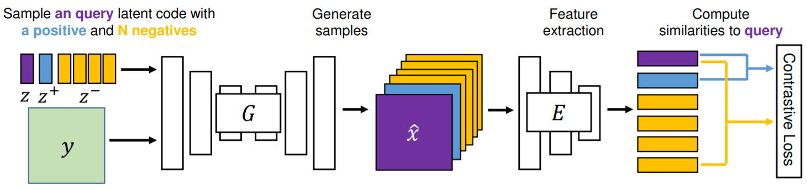

Conditional generative adversarial networks (cGANs) target at synthesizing diverse images given the input conditions and latent codes, but unfortunately, they usually suffer from the issue of mode collapse. To solve this issue, previous works mainly focused on encouraging the correlation between the latent codes and their generated images, while ignoring the relations between images generated from various latent codes. The recent MSGAN tried to encourage the diversity of the generated image but only considers &quot;negative&quot; relations between the image pairs. In this paper, we propose a novel DivCo framework to properly constrain both &quot;positive&quot; and &quot;negative&quot; relations between the generated images specified in the latent space. To the best of our knowledge, this is the first attempt to use contrastive learning for diverse conditional image synthesis. A novel latent-augmented contrastive loss is introduced, which encourages images generated from adjacent latent codes to be similar and those generated from distinct latent codes to be dissimilar. The proposed latent-augmented contrastive loss is well compatible with various cGAN architectures. Extensive experiments demonstrate that the proposed DivCo can produce more diverse images than state-of-the-art methods without sacrificing visual quality in multiple unpaired and paired image generation tasks.

[Download paper here](https://chinglamchoi.github.io/cchoi/files/divco.pdf)

